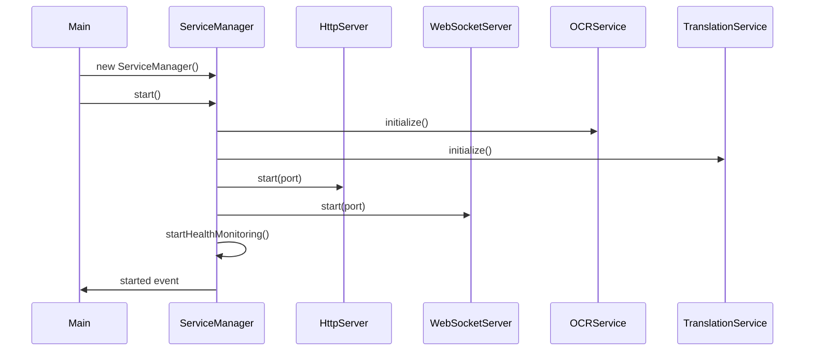
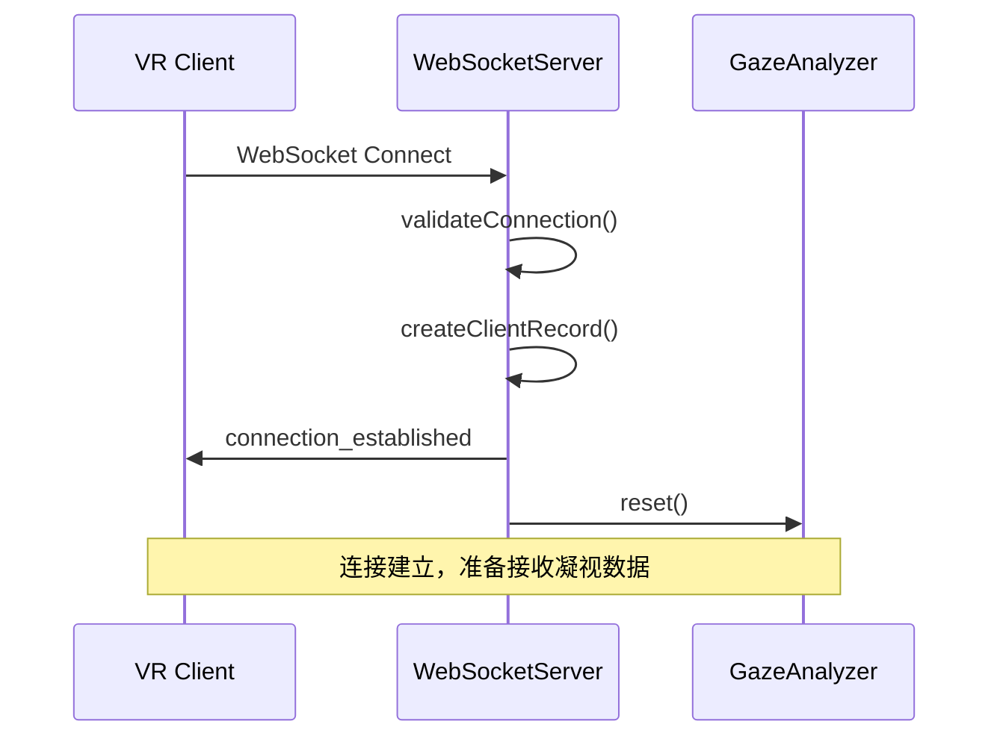
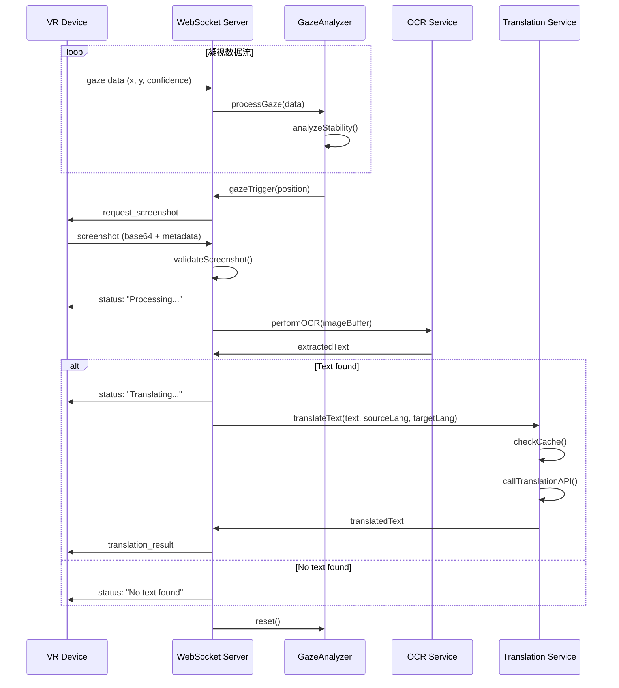
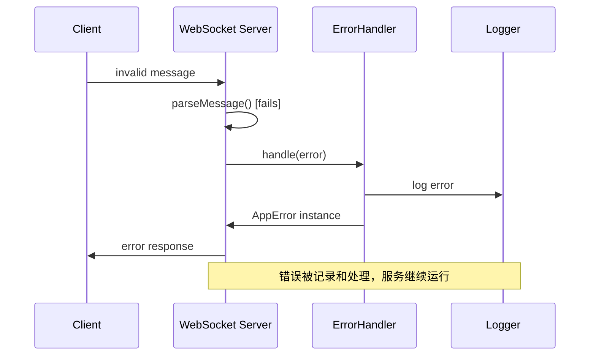

# VR翻译后端架构与工作流程

## 概述

VR翻译后端是一个基于Node.js的实时翻译服务，专门设计用于处理VR设备（特别是Quest 3）的头部凝视追踪和实时文本翻译需求。

## 核心架构

### 1. 系统架构图

```
┌─────────────────┐    ┌─────────────────┐    ┌─────────────────┐
│   VR Client     │    │   WebSocket     │    │   HTTP Server   │
│   (Quest 3)     │◄──►│     Server      │◄──►│   (Health/API)  │
└─────────────────┘    └─────────────────┘    └─────────────────┘
                              │
                              ▼
                    ┌─────────────────┐
                    │  Service        │
                    │  Manager        │
                    └─────────────────┘
                              │
                ┌─────────────┼─────────────┐
                ▼             ▼             ▼
        ┌─────────────┐ ┌─────────────┐ ┌─────────────┐
        │ GazeAnalyzer│ │ OCRService  │ │Translation │
        │             │ │             │ │ Service    │
        └─────────────┘ └─────────────┘ └─────────────┘
```

### 2. 核心组件

#### ServiceManager
- **职责**: 统一管理所有服务的生命周期
- **功能**: 
  - 服务启动/停止协调
  - 健康监控
  - 优雅关闭
  - 错误恢复
  - 性能指标收集

#### TranslationServer (WebSocket)
- **职责**: 处理与VR客户端的实时通信
- **功能**:
  - 客户端连接管理
  - 凝视数据处理
  - 截图接收与处理
  - 实时状态推送
  - 错误处理与恢复

#### GazeAnalyzer
- **职责**: 分析头部凝视数据，检测稳定注视
- **功能**:
  - 头部凝视模式优化
  - 稳定性阈值判断
  - 触发事件生成
  - 自适应参数调整

#### OCRService
- **职责**: 从图像中识别文本
- **功能**:
  - 图像预处理
  - 文本识别
  - 结果验证
  - 多引擎支持

#### TranslationService
- **职责**: 文本翻译处理
- **功能**:
  - 多引擎支持 (DeepL, Google, Mock)
  - 缓存管理
  - 批量翻译
  - 错误重试

## 详细工作流程

### 1. 系统启动流程



### 2. 客户端连接流程



### 3. 实时翻译工作流程



### 4. 错误处理流程



## 代码质量改进

### 1. 类型安全

```typescript
// 统一类型定义
interface GazeData {
    x: number;
    y: number;
    confidence?: number;
    timestamp?: number;
    deviceType?: 'eye_tracker' | 'head_gaze' | 'mouse';
}

// 类型守卫
function isGazeData(data: any): data is GazeData {
    return typeof data === 'object' && 
           typeof data.x === 'number' && 
           typeof data.y === 'number';
}
```

### 2. 错误处理

```typescript
// 统一错误类型
export class AppError extends Error {
    public readonly code: ErrorCode;
    public readonly statusCode: number;
    public readonly isOperational: boolean;
    public readonly context?: ErrorContext;
}

// 异步错误包装
export function asyncHandler<T extends any[], R>(
    fn: (...args: T) => Promise<R>
): (...args: T) => Promise<R> {
    return async (...args: T): Promise<R> => {
        try {
            return await fn(...args);
        } catch (error) {
            throw ErrorHandler.handle(error as Error);
        }
    };
}
```

### 3. 性能监控

```typescript
// 性能指标收集
interface PerformanceMetrics {
    requestCount: number;
    averageProcessingTime: number;
    errorRate: number;
    cacheHitRate: number;
    activeConnections: number;
    memoryUsage: MemoryUsage;
}

// 实时监控
private updateAverageProcessingTime(newTime: number): void {
    if (this.metrics.requestCount === 1) {
        this.metrics.averageProcessingTime = newTime;
    } else {
        this.metrics.averageProcessingTime = 
            (this.metrics.averageProcessingTime * (this.metrics.requestCount - 1) + newTime) / 
            this.metrics.requestCount;
    }
}
```

## 关键改进点

### 1. 架构改进

**改进前:**
- 松散的服务管理
- 基本的错误处理
- 简单的WebSocket连接管理

**改进后:**
- 统一的ServiceManager管理所有服务
- 完善的错误处理和分类系统
- 智能的客户端连接管理和健康监控

### 2. 可靠性提升

- **超时处理**: 所有异步操作都有超时机制
- **优雅关闭**: 服务可以安全地停止和重启
- **错误恢复**: 操作失败后的自动恢复机制
- **健康监控**: 实时监控服务状态

### 3. 性能优化

- **连接池管理**: 智能的客户端连接管理
- **缓存策略**: 翻译结果缓存减少API调用
- **内存监控**: 实时内存使用监控
- **指标收集**: 详细的性能指标

### 4. 开发体验

- **类型安全**: 完整的TypeScript类型定义
- **统一错误**: 一致的错误处理和报告
- **详细日志**: 结构化的日志记录
- **调试支持**: 丰富的调试信息

## 部署和维护

### 1. 健康检查端点

```http
GET /health
{
  "status": "healthy",
  "services": {
    "websocket": { "status": "up", "connections": 5 },
    "translation": { "status": "up" },
    "ocr": { "status": "up" }
  },
  "uptime": 3600,
  "timestamp": 1640995200000
}
```

### 2. 指标端点

```http
GET /metrics
{
  "requestCount": 1234,
  "averageProcessingTime": 850,
  "errorRate": 0.02,
  "activeConnections": 8,
  "memoryUsage": {
    "heapUsed": 45,
    "heapTotal": 67
  }
}
```

### 3. 运维命令

```bash
# 优雅重启
curl -X POST http://localhost:3000/admin/restart

# 检查连接
curl http://localhost:3000/admin/connections

# 获取详细状态
curl http://localhost:3000/admin/status
```

## 未来扩展

### 1. 水平扩展
- 支持多实例部署
- 负载均衡
- 共享缓存（Redis）
- 消息队列（RabbitMQ/Kafka）

### 2. 高级功能
- A/B测试框架
- 实时分析面板
- 自动扩缩容
- 多语言智能检测

### 3. 监控和报警
- Prometheus指标导出
- Grafana仪表板
- 自动报警
- 性能基准测试

这个重构后的后端架构为VR翻译服务提供了企业级的可靠性、可扩展性和可维护性。