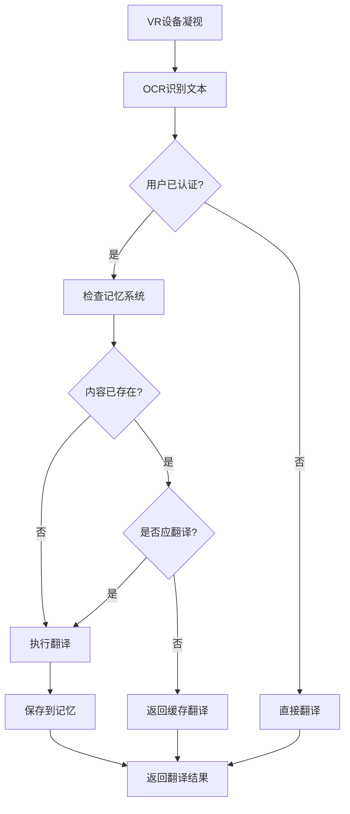

# VR翻译记忆系统完整指南

## 系统概述

VR翻译记忆系统是一个基于艾宾浩斯遗忘曲线的智能记忆管理系统，专为Quest 3等VR设备设计。系统支持个人化的记忆管理，包括用户注册、内容记忆、永久记忆设置和智能复习提醒。

## 核心特性

### 🔐 用户认证系统
- **用户注册与登录**: 独立的用户账户系统
- **JWT令牌认证**: 安全的会话管理
- **个性化设置**: 每个用户独立的记忆库

### 🧠 艾宾浩斯遗忘曲线
- **科学的记忆算法**: 基于艾宾浩斯遗忘曲线理论
- **智能复习提醒**: 根据记忆强度自动安排复习时间
- **难度自适应**: 根据用户表现调整记忆难度

### 💾 记忆管理
- **多种记忆类型**: 单词、词组、句子、段落
- **状态管理**: 临时记忆、永久记忆、学习中、已遗忘
- **智能缓存**: 避免重复翻译，提升响应速度

### 🚫 翻译控制
- **智能跳过**: 对已记忆内容不触发翻译
- **用户可控**: 支持设置永久记忆内容
- **上下文感知**: 基于VR设备的凝视数据

## 系统架构

### 数据模型

```typescript
// 用户模型
interface User {
    id: string;
    username: string;
    email: string;
    preferences: UserPreferences;
    createdAt: Date;
}

// 记忆项模型
interface MemoryItem {
    id: string;
    userId: string;
    content: string;
    translatedContent: string;
    type: MemoryType;
    status: MemoryStatus;
    retentionData: RetentionData;
    context?: MemoryContext;
}

// 艾宾浩斯保持数据
interface RetentionData {
    initialStrength: number;
    currentStrength: number;
    nextReviewAt?: Date;
    reviewCount: number;
    difficultyLevel: number;
}
```

### 工作流程



## API接口

### 认证接口

#### 用户注册
```http
POST /api/memory/register
Content-Type: application/json

{
  "username": "user123",
  "email": "user@example.com",
  "password": "securePassword123",
  "preferences": {
    "defaultSourceLanguage": "en",
    "defaultTargetLanguage": "zh"
  }
}
```

#### 用户登录
```http
POST /api/memory/login
Content-Type: application/json

{
  "username": "user123",
  "password": "securePassword123"
}
```

### 记忆管理接口

#### 创建记忆项
```http
POST /api/memory/items
Authorization: Bearer <token>
Content-Type: application/json

{
  "content": "Hello World",
  "translatedContent": "你好世界",
  "sourceLang": "en",
  "targetLang": "zh",
  "type": "phrase",
  "status": "temporary"
}
```

#### 查询记忆项
```http
GET /api/memory/items?content=hello&type=word&limit=20
Authorization: Bearer <token>
```

#### 设置永久记忆
```http
POST /api/memory/permanent
Authorization: Bearer <token>
Content-Type: application/json

{
  "memoryIds": ["uuid1", "uuid2", "uuid3"]
}
```

#### 获取复习列表
```http
GET /api/memory/review?limit=10
Authorization: Bearer <token>
```

#### 记录复习结果
```http
POST /api/memory/review/uuid1
Authorization: Bearer <token>
Content-Type: application/json

{
  "isSuccessful": true,
  "responseTime": 2500,
  "userDifficulty": 2
}
```

### WebSocket消息

#### 客户端认证
```json
{
  "type": "authenticate",
  "payload": {
    "token": "jwt_token_here"
  }
}
```

#### 记忆检查
```json
{
  "type": "memory_check",
  "payload": {
    "content": "Hello",
    "sourceLang": "en",
    "targetLang": "zh"
  }
}
```

#### 服务器响应
```json
{
  "type": "memory_check_result",
  "payload": {
    "exists": true,
    "shouldTranslate": false,
    "cachedTranslation": "你好"
  }
}
```

## 艾宾浩斯遗忘曲线算法

### 保持率计算

系统使用以下公式计算记忆保持率：

```typescript
// 基础遗忘曲线: R(t) = e^(-t/S)
function calculateRetention(
    timeElapsed: number,
    initialStrength: number,
    reviewCount: number,
    difficultyLevel: number
): number {
    const hoursElapsed = timeElapsed / (1000 * 60 * 60);
    const baseForgettingRate = calculateBaseForgettingRate(difficultyLevel);
    const reviewBonus = calculateReviewBonus(reviewCount);
    const memoryStrength = initialStrength * reviewBonus;
    const adjustedForgettingRate = baseForgettingRate / memoryStrength;
    
    return Math.exp(-hoursElapsed / adjustedForgettingRate);
}
```

### 复习间隔

系统使用间隔重复算法安排复习时间：

| 复习次数 | 间隔时间 | 说明 |
|---------|---------|------|
| 1 | 20分钟 | 第一次复习 |
| 2 | 1小时 | 短期强化 |
| 3 | 9小时 | 当日复习 |
| 4 | 1天 | 隔日复习 |
| 5 | 2天 | 延长间隔 |
| 6 | 4天 | 进一步延长 |
| 7+ | 1周+ | 长期保持 |

### 难度调整

系统根据以下因素自动调整难度：

- **响应时间**: 响应越慢，难度越高
- **成功率**: 成功率低则增加难度
- **用户反馈**: 用户可手动调整难度

## VR设备集成

### Quest 3 头部凝视

```typescript
// 凝视数据结构
interface GazeData {
    x: number;
    y: number;
    confidence?: number;
    timestamp?: number;
    deviceType?: 'head_gaze';
}

// 记忆上下文
interface MemoryContext {
    gazePosition?: GazeData;
    timestamp: Date;
    deviceInfo?: DeviceInfo;
    translationTrigger: 'gaze' | 'manual';
}
```

### 翻译触发控制

1. **永久记忆**: 不触发翻译，直接返回缓存结果
2. **排除内容**: 用户标记的不翻译内容
3. **遗忘内容**: 记忆强度低的内容会重新翻译以强化记忆
4. **新内容**: 首次遇到的内容正常翻译并保存

## 数据管理

### 记忆状态

- **TEMPORARY**: 临时记忆，遵循遗忘曲线
- **PERMANENT**: 永久记忆，不会遗忘
- **LEARNING**: 学习中，需要复习
- **FORGOTTEN**: 已遗忘，需要重新学习
- **EXCLUDED**: 排除翻译

### 自动清理

系统会自动清理符合以下条件的临时记忆：
- 记忆强度 < 30%
- 超过30天未访问
- 用户未设置为永久记忆

## 使用示例

### Unity客户端集成

```csharp
// 认证
var authMessage = new {
    type = "authenticate",
    payload = new {
        username = "user123",
        password = "password"
    }
};
websocket.Send(JsonUtility.ToJson(authMessage));

// 设置永久记忆
var permanentMessage = new {
    type = "memory_update",
    payload = new {
        memoryId = "uuid1",
        updates = new {
            status = "permanent"
        }
    }
};
websocket.Send(JsonUtility.ToJson(permanentMessage));
```

### Web管理界面

```javascript
// 获取用户记忆统计
const response = await fetch('/api/memory/stats', {
    headers: {
        'Authorization': `Bearer ${token}`
    }
});
const stats = await response.json();

// 批量设置永久记忆
await fetch('/api/memory/permanent', {
    method: 'POST',
    headers: {
        'Authorization': `Bearer ${token}`,
        'Content-Type': 'application/json'
    },
    body: JSON.stringify({
        memoryIds: selectedIds
    })
});
```

## 性能优化

### 缓存策略

1. **内存缓存**: 最近访问的记忆项缓存在内存中
2. **翻译缓存**: 永久记忆的翻译结果直接缓存
3. **批量操作**: 支持批量查询和更新

### 数据库优化

1. **索引**: 用户ID、内容哈希、时间戳等关键字段建立索引
2. **分页**: 大量数据使用分页查询
3. **压缩**: 长文本内容使用压缩存储

## 安全考虑

### 数据保护

- **密码加密**: 使用bcrypt加密用户密码
- **JWT安全**: 令牌包含过期时间，支持刷新
- **数据隔离**: 每个用户的记忆数据完全隔离

### 访问控制

- **认证必需**: 所有记忆操作需要有效的JWT令牌
- **权限验证**: 用户只能访问自己的记忆数据
- **速率限制**: API请求有频率限制

## 部署指南

### 环境变量

```bash
# 认证配置
JWT_SECRET=your-super-secret-key
JWT_EXPIRY=7d

# 数据库配置（如果使用数据库）
DB_HOST=localhost
DB_PORT=5432
DB_NAME=vr_translate
DB_USER=username
DB_PASS=password

# 记忆系统配置
MEMORY_CLEANUP_INTERVAL=24h
MAX_MEMORY_ITEMS_PER_USER=10000
```

### Docker部署

```dockerfile
FROM node:18-alpine

WORKDIR /app
COPY package*.json ./
RUN npm ci --only=production

COPY . .
RUN npm run build

EXPOSE 3000 8080

CMD ["npm", "start"]
```

## 故障排除

### 常见问题

1. **记忆不生效**: 检查用户是否已认证
2. **复习提醒不准**: 检查系统时间和遗忘曲线参数
3. **性能问题**: 检查缓存配置和数据库索引

### 日志分析

系统会记录详细的操作日志，包括：
- 用户认证事件
- 记忆创建和更新
- 翻译触发决策
- 复习记录

## 未来扩展

### 计划功能

1. **协作学习**: 用户可以分享记忆库
2. **智能推荐**: 根据用户行为推荐学习内容
3. **多设备同步**: 支持多设备间的记忆同步
4. **学习分析**: 提供详细的学习进度分析

### 技术升级

1. **数据库迁移**: 从内存存储迁移到PostgreSQL
2. **分布式部署**: 支持微服务架构
3. **机器学习**: 使用ML算法优化遗忘曲线参数
4. **实时同步**: WebSocket实时同步记忆更新

这个记忆系统为VR翻译应用提供了完整的个人化记忆管理功能，通过科学的遗忘曲线算法和灵活的API设计，确保用户能够有效管理和控制翻译内容的记忆状态。